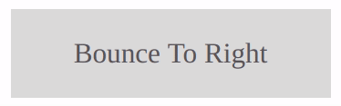

# Button Animations

<!--  -->

Button Animations it's a library for buttons animations

## Collection





## Usage

If you need any effect, just copy the code of the effect that is separated by comments.

```CSS
/* Name Effect */

/* --- */
```

## Contributing

Pull requests are welcome. For major changes, please open an issue first to discuss what you would like to change.

Please make sure to update tests as appropriate.

## License

[MIT](https://github.com/paulotijero/css-animations/blob/master/LICENSE)
